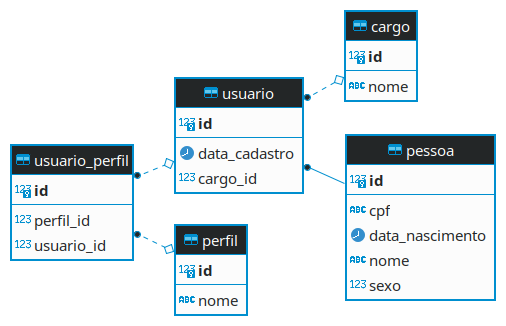

<h1 align="center">
    User Manager
</h1>


## Sobre o projeto

User Manager - é um gerenciador de usuários, perfis e cargos.


Projeto desenvolvido para processo seletivo da Agência Zetta.

## Tecnologias

As seguintes ferramentas foram usadas na construção do projeto:

#### **Website**

- [React][reactjs]
- [Axios][axios]
- [Bootstrap][bootstrap]

#### **Server**

  - [SpringBoot][spring]
  - [Postgres][postgres]

##  Como executar o projeto

Este projeto está dividido em 2 partes:
1. FrontEnd
2. Backend (Diretório userManager)

### Pré-requisitos

Antes de começar, você vai precisar ter instalado em sua máquina as seguintes ferramentas:
[Git](https://git-scm.com), [Node.js][nodejs], [Java JDK 11][java-11], [Maven][maven] e [PostgresSQL][postgres].
Além disto é bom ter um editor para trabalhar com o código como [VSCode][vscode] ou [SpringTools][springtools]

###  Banco de dados
#### Diagrama


O banco de dados utilizado é o PostgresSQL
Antes de iniciar a aplicação crie o banco de dados: `CREATE DATABASE usermanager`

###  Rodando o Backend (Servidor)
Verifique no arquivo **application.properties** se o nome de usuário e senha
de seu banco de dados é o default (username: postgres e password: postgres). Caso não seja, troque de acordo com suas credenciais.

```bash
# Clone este repositório
$ git clone https://github.com/brian-hm/UserManager.git

# Acesse a pasta do projeto no terminal/cmd
$ cd UserManager

# Acesse a pasta do backend do projeto no terminal/cmd
$ cd userManager

# Inicie a aplicação
$ mvn spring-boot:run

# A aplicação será aberta na porta:8080
```

###  Rodando a aplicação web (Front End)

```bash
# Clone este repositório
$ git clone https://github.com/brian-hm/UserManager.git

# Acesse a pasta do projeto no terminal/cmd
$ cd UserManager

# Acesse a pasta do frontend do projeto no terminal/cmd
$ cd frontend

# Instale as dependências
$ npm install

# Inicie a aplicação
$ npm start

# A aplicação será aberta na porta:3000 - acesse http://localhost:3000
```


Feito por Brian Messias - [Entre em contato!](https://www.linkedin.com/in/brian-messias-9962051a5/)

[axios]: https://github.com/axios/axios
[bootstrap]: https://getbootstrap.com/
[spring]: https://spring.io/projects/spring-boot
[reactjs]: https://reactjs.org
[vscode]: https://code.visualstudio.com/
[postgres]: https://www.postgresql.org/
[maven]: https://maven.apache.org/download.cgi
[java-11]: https://openjdk.java.net/projects/jdk/11/
[nodejs]: https://nodejs.org/en/
[springtools]: https://spring.io/tools